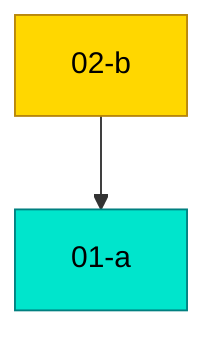

# MDD Connections

## Path Tree

**X/Y**
  └── `01-a` - A (done)
**X/Z**
  └── `02-b` - B (active)

## Dependency Graph

## Source File Overlap

Files referenced by 2+ docs:

(none)

## Warnings

- broken depends_on: 01-a references 99-missing (no such doc)
