# MDD Connections

## Path Tree

**Build / Boundary Lint**
  └── `08-boundary-lint` - Boundary Lint (complete)
**Build / Bundle**
  └── `41-bundle` - Bundle (complete)
**Build / Package Skeleton**
  └── `07-package-skeleton` - Package Skeleton (complete)
**Build / Seed Script**
  └── `01-seed-script` - Seed Script (complete)
**CLI / CI Mode**
  └── `28-ci-mode` - CI Mode (complete)
**CLI / Doctor**
  └── `30-doctor` - Doctor (complete)
**CLI / Init**
  └── `31-init` - Init (complete)
**CLI / Router**
  └── `13-cli-router` - CLI Router (complete)
**Contracts / Bare Checkout**
  └── `37-cr8-bare-checkout` - CR-8: Bare Checkout (complete)
**Contracts / Contract Scans**
  └── `42-contract-scans` - Contract Scans (complete)
**Contracts / Deny By Default**
  └── `06-cr5-deny-by-default` - CR-5: Deny By Default (complete)
**Contracts / Doc Corpus Integrity**
  └── `38-cr9-doc-corpus-integrity` - CR-9: Doc Corpus Integrity (complete)
**Contracts / Fallback Totality**
  └── `14-cr6-fallback-totality` - CR-6: Fallback Totality (complete)
**Contracts / Markdown Out**
  └── `16-cr11-markdown-out` - CR-11: Markdown Out (complete)
**Contracts / No Daemon No Memory**
  └── `05-cr4-no-daemon-no-memory` - CR-4: No Daemon, No Memory (complete)
**Contracts / One Package**
  └── `03-cr2-one-package` - CR-2: One Package (complete)
**Contracts / Render Purity**
  └── `15-cr10-render-purity` - CR-10: Render Purity (complete)
**Contracts / Reuse Fidelity**
  └── `39-cr-d7-reuse-fidelity` - CR-D7: Reuse Fidelity (complete)
**Contracts / Stage Only**
  └── `04-cr3-stage-only` - CR-3: Stage Only (complete)
**Contracts / Standalone Identity**
  └── `02-cr1-standalone-identity` - CR-1: Standalone Identity (complete)
**Contracts / Suite Baseline**
  └── `25-cr7-suite-baseline` - CR-7: Suite Baseline (complete)
**Directives / Assert Liveness**
  └── `27-assert-liveness` - Assert Liveness (complete)
**Directives / Assert Operators**
  └── `26-assert-operators` - Assert Operators (complete)
**Directives / Composition**
  └── `19-composition-directives` - Composition Directives (complete)
**Directives / Compute**
  └── `18-compute-directives` - Compute Directives (complete)
**Directives / Frontmatter Query**
  └── `36-frontmatter-query` - Frontmatter Query (complete)
**Directives / Graph**
  └── `34-graph` - Graph (complete)
**Directives / Pipe**
  └── `22-pipe` - Pipe (complete)
**Directives / Sources**
  └── `17-source-directives` - Source Directives (complete)
**Directives / Update Frontmatter**
  └── `33-update-frontmatter` - Update Frontmatter (complete)
**Docs / README Generation**
  └── `48-auto-readme-generation` - Auto README Generation (complete)
**Docs / User Guide**
  └── `45-user-guide` - User Guide (complete)
**Docs / Verification Closeout**
  └── `43-doc-verification-closeout` - Doc Verification Closeout (complete)
**Engine / Args**
  └── `23-arguments` - Arguments (F-ARGS) (complete)
**Engine / Cache**
  └── `21-cache` - Cache (complete)
**Engine / Code Runners**
  └── `29-code-runners` - Code Runners (complete)
**Engine / Determinism**
  └── `35-determinism` - Determinism (complete)
**Engine / Fallback Contract**
  └── `24-fallback-contract` - Fallback Contract (complete)
**Engine / Render Trace**
  └── `12-render-trace` - Render Trace (complete)
**Engine / Schema Engine**
  └── `32-schema-engine` - Schema Engine (complete)
**Examples / Connections**
  └── `46-connections-example` - Connections Example (complete)
**Examples / Pattern Example**
  └── `40-pattern-example` - Pattern Example (complete)
**Examples / Reach Via Code**
  └── `47-reach-via-code` - Reach Via Code (complete)
**Examples / Showcase**
  └── `44-examples-showcase` - Examples Showcase (complete)
**Hook / Extension Routing**
  └── `11-extension-routing` - Extension Routing (Hook) (complete)
**Parser / Grammar**
  └── `09-grammar-parser` - Grammar Parser (complete)
**Renderer / Formats**
  └── `20-render-formats` - Render Formats (complete)
**Security / Policy Core**
  └── `10-security-policy-core` - Security Policy Core (complete)

## Dependency Graph

```mermaid
graph TD
  classDef planned fill:#aaa,stroke:#666,color:#000
  classDef active fill:#ffd700,stroke:#b8860b,color:#000
  classDef done fill:#00e5cc,stroke:#008080,color:#000
  classDef deprecated fill:#f44,stroke:#a00,color:#fff
  01_seed_script["01-seed-script"]:::done
  02_cr1_standalone_identity["02-cr1-standalone-identity"]:::done
  03_cr2_one_package["03-cr2-one-package"]:::done
  04_cr3_stage_only["04-cr3-stage-only"]:::done
  05_cr4_no_daemon_no_memory["05-cr4-no-daemon-no-memory"]:::done
  06_cr5_deny_by_default["06-cr5-deny-by-default"]:::done
  07_package_skeleton["07-package-skeleton"]:::done
  08_boundary_lint["08-boundary-lint"]:::done
  09_grammar_parser["09-grammar-parser"]:::done
  10_security_policy_core["10-security-policy-core"]:::done
  11_extension_routing["11-extension-routing"]:::done
  12_render_trace["12-render-trace"]:::done
  13_cli_router["13-cli-router"]:::done
  14_cr6_fallback_totality["14-cr6-fallback-totality"]:::done
  15_cr10_render_purity["15-cr10-render-purity"]:::done
  16_cr11_markdown_out["16-cr11-markdown-out"]:::done
  17_source_directives["17-source-directives"]:::done
  18_compute_directives["18-compute-directives"]:::done
  19_composition_directives["19-composition-directives"]:::done
  20_render_formats["20-render-formats"]:::done
  21_cache["21-cache"]:::done
  22_pipe["22-pipe"]:::done
  23_arguments["23-arguments"]:::done
  24_fallback_contract["24-fallback-contract"]:::done
  25_cr7_suite_baseline["25-cr7-suite-baseline"]:::done
  26_assert_operators["26-assert-operators"]:::done
  27_assert_liveness["27-assert-liveness"]:::done
  28_ci_mode["28-ci-mode"]:::done
  29_code_runners["29-code-runners"]:::done
  30_doctor["30-doctor"]:::done
  31_init["31-init"]:::done
  32_schema_engine["32-schema-engine"]:::done
  33_update_frontmatter["33-update-frontmatter"]:::done
  34_graph["34-graph"]:::done
  35_determinism["35-determinism"]:::done
  36_frontmatter_query["36-frontmatter-query"]:::done
  37_cr8_bare_checkout["37-cr8-bare-checkout"]:::done
  38_cr9_doc_corpus_integrity["38-cr9-doc-corpus-integrity"]:::done
  39_cr_d7_reuse_fidelity["39-cr-d7-reuse-fidelity"]:::done
  40_pattern_example["40-pattern-example"]:::done
  41_bundle["41-bundle"]:::done
  42_contract_scans["42-contract-scans"]:::done
  43_doc_verification_closeout["43-doc-verification-closeout"]:::done
  44_examples_showcase["44-examples-showcase"]:::done
  45_user_guide["45-user-guide"]:::done
  46_connections_example["46-connections-example"]:::done
  47_reach_via_code["47-reach-via-code"]:::done
  48_auto_readme_generation["48-auto-readme-generation"]:::done
  07_package_skeleton --> 01_seed_script
  07_package_skeleton --> 03_cr2_one_package
  08_boundary_lint --> 07_package_skeleton
  09_grammar_parser --> 07_package_skeleton
  10_security_policy_core --> 06_cr5_deny_by_default
  10_security_policy_core --> 07_package_skeleton
  11_extension_routing --> 04_cr3_stage_only
  11_extension_routing --> 09_grammar_parser
  12_render_trace --> 05_cr4_no_daemon_no_memory
  12_render_trace --> 07_package_skeleton
  13_cli_router --> 07_package_skeleton
  17_source_directives --> 09_grammar_parser
  17_source_directives --> 10_security_policy_core
  17_source_directives --> 11_extension_routing
  18_compute_directives --> 10_security_policy_core
  18_compute_directives --> 17_source_directives
  19_composition_directives --> 09_grammar_parser
  19_composition_directives --> 17_source_directives
  20_render_formats --> 16_cr11_markdown_out
  20_render_formats --> 19_composition_directives
  21_cache --> 10_security_policy_core
  22_pipe --> 19_composition_directives
  22_pipe --> 21_cache
  23_arguments --> 19_composition_directives
  24_fallback_contract --> 11_extension_routing
  24_fallback_contract --> 12_render_trace
  24_fallback_contract --> 14_cr6_fallback_totality
  26_assert_operators --> 17_source_directives
  26_assert_operators --> 18_compute_directives
  26_assert_operators --> 19_composition_directives
  27_assert_liveness --> 26_assert_operators
  28_ci_mode --> 13_cli_router
  28_ci_mode --> 26_assert_operators
  29_code_runners --> 10_security_policy_core
  29_code_runners --> 18_compute_directives
  30_doctor --> 10_security_policy_core
  30_doctor --> 12_render_trace
  30_doctor --> 27_assert_liveness
  30_doctor --> 29_code_runners
  31_init --> 10_security_policy_core
  31_init --> 11_extension_routing
  31_init --> 30_doctor
  32_schema_engine --> 10_security_policy_core
  32_schema_engine --> 17_source_directives
  33_update_frontmatter --> 32_schema_engine
  34_graph --> 20_render_formats
  34_graph --> 32_schema_engine
  35_determinism --> 18_compute_directives
  35_determinism --> 21_cache
  36_frontmatter_query --> 17_source_directives
  36_frontmatter_query --> 20_render_formats
  36_frontmatter_query --> 32_schema_engine
  40_pattern_example --> 19_composition_directives
  40_pattern_example --> 24_fallback_contract
  40_pattern_example --> 33_update_frontmatter
  41_bundle --> 07_package_skeleton
  41_bundle --> 13_cli_router
  42_contract_scans --> 02_cr1_standalone_identity
  42_contract_scans --> 03_cr2_one_package
  42_contract_scans --> 04_cr3_stage_only
  42_contract_scans --> 05_cr4_no_daemon_no_memory
  42_contract_scans --> 06_cr5_deny_by_default
  42_contract_scans --> 14_cr6_fallback_totality
  42_contract_scans --> 15_cr10_render_purity
  42_contract_scans --> 16_cr11_markdown_out
  42_contract_scans --> 25_cr7_suite_baseline
  42_contract_scans --> 37_cr8_bare_checkout
  42_contract_scans --> 38_cr9_doc_corpus_integrity
  42_contract_scans --> 39_cr_d7_reuse_fidelity
  43_doc_verification_closeout --> 38_cr9_doc_corpus_integrity
  44_examples_showcase --> 02_cr1_standalone_identity
  44_examples_showcase --> 20_render_formats
  44_examples_showcase --> 24_fallback_contract
  45_user_guide --> 02_cr1_standalone_identity
  45_user_guide --> 40_pattern_example
  46_connections_example --> 20_render_formats
  46_connections_example --> 34_graph
  46_connections_example --> 36_frontmatter_query
  47_reach_via_code --> 29_code_runners
  48_auto_readme_generation --> 09_grammar_parser
  48_auto_readme_generation --> 13_cli_router
  48_auto_readme_generation --> 17_source_directives
  48_auto_readme_generation --> 20_render_formats
  48_auto_readme_generation --> 36_frontmatter_query
```

## Source File Overlap

Files referenced by 2+ docs:

- `eslint.config.js` - 07-package-skeleton, 08-boundary-lint
- `package.json` - 07-package-skeleton, 41-bundle
- `src/cli/cli.ts` - 13-cli-router, 41-bundle
- `src/engine/engine-include.ts` - 19-composition-directives, 41-bundle
- `src/engine/engine.ts` - 17-source-directives, 29-code-runners, 35-determinism
- `src/engine/frontmatter-utils.ts` - 33-update-frontmatter, 36-frontmatter-query
- `src/engine/sources.ts` - 17-source-directives, 36-frontmatter-query
- `src/hook/pretooluse.ts` - 11-extension-routing, 41-bundle

## Warnings

(none)
