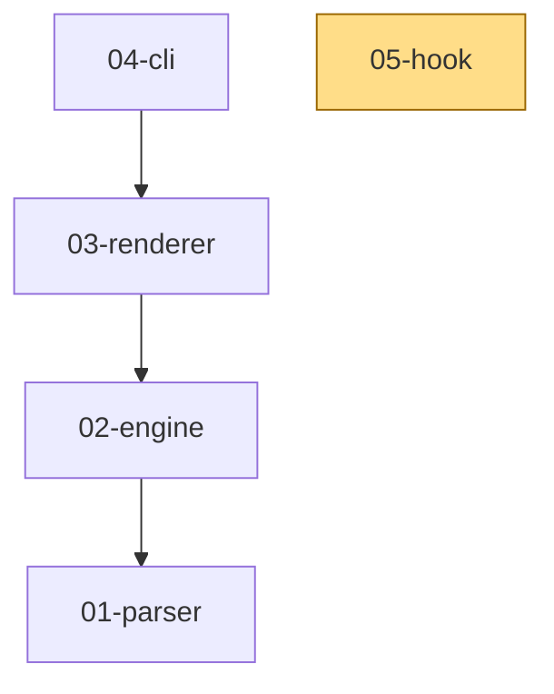

# Project Connections

The doc that proves "generated file" is a category LiveStage deletes. A
project connections index like this one is usually a script someone runs
by hand and forgets to re-run; here it is just a `.stage` file, correct on
every render because nothing in it is stored, only computed.

## Overview

Rendered 2026-08-17T14:38:11.051Z. Corpus: 5 documents.

## Path tree

- Core
  - Parser (status: complete)
  - Engine (status: complete)
  - Renderer (status: complete)
- Build
  - CLI (status: in_progress)
  - Hook (status: planned)

## Dependency graph

5 docs, 3 dependency edges,
1 broken.

**Broken dependency edges** (`depends_on` pointing at a doc id that does
not exist in this corpus):
- 05-hook -> 99-nonexistent-doc

## Source-file overlap

Which files more than one doc claims to own, the canonical nested-array
`@code` pattern (F-FM-QUERY's `where=` does not support this, feature 36
business rule 6):

| file               | owners                 |
|--------------------|------------------------|
| src/shared/util.ts | 01-parser, 03-renderer |
